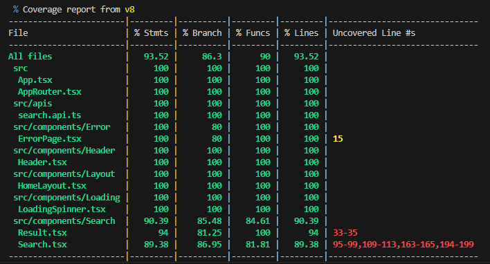
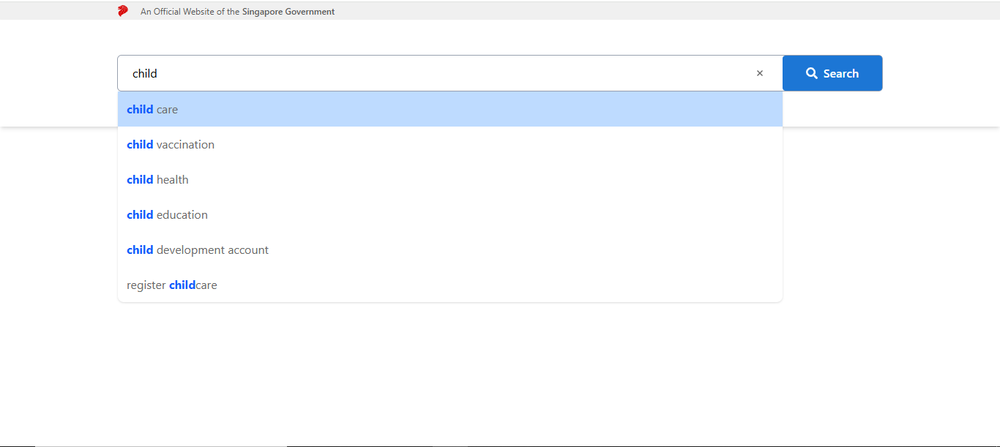
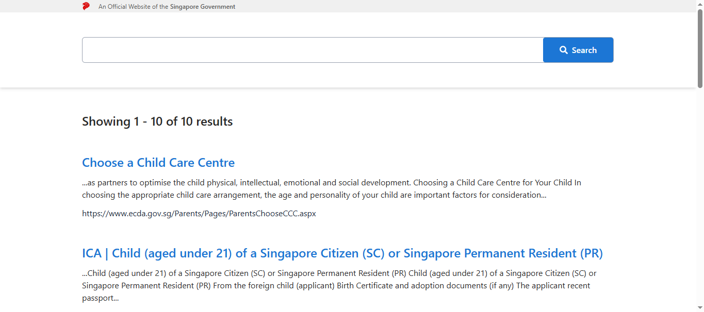
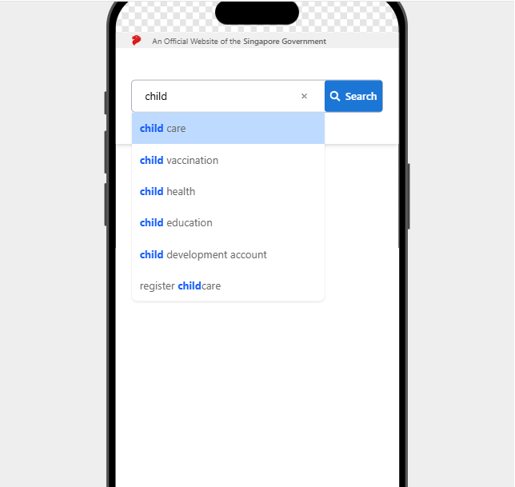
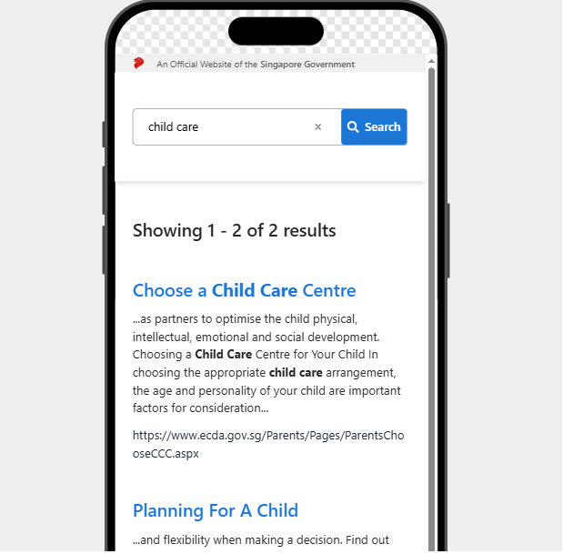

# Web Dev Tech Assignment for GovTech - 2025

A search portal SPA that allows users to search for information on the Government of Singapore's website.

This is a submission for the [GovTech's 2025 assignment](https://gist.github.com/yuhong90/b5544baebde4bfe9fe2d12e8e5502cbf).

## 💻 Table of Contents

- 🔗 [Deployments](#deployments)
- 🗄️ [Project Structure](#project-structure)
- ⚙️ [Installation](#installation)
- 🚄 [Run the App](#run-the-app)
- 🧪 [Run Unit Tests](#run-unit-tests)
- 🧱 [Technologies Used](#technologies-used)
- 📷 [Preview](#preview)
- 📝 [Assumptions](#assumptions)

<h2 id="deployments">🔗 Deployments</h2>

### (Fallback) Vercel
 [Vercel Domain Name 🔗](https://govtech-react-search-app.vercel.app/) ( Vercel has a cold-start phase so the project may take a minute to be ready)

<h2 id="project-structure">🗄️ Project Structure</h2>

```
src
├───apis                # apis folder
├───assets              # additional assets folder
├───components          # shared stateless UI 
├───config              # configuration
├───types               # all defined types
```

<h2 id="installation">⚙️ Installation</h2>
- Node.js (version 18 and above)
- npm (comes with NodeJS)

1. Clone the repository

   ```bash
   git clone https://github.com/NghiTo/Govtech-react-search-app.git
   cd Govtech-react-search-app
   ```

2. Install dependencies

   ```bash
    npm install
   ```

<h2 id="run-the-app">🚄 Run the App</h2>

This will start a development server on port 5173 by default.

```bash
npm run dev
```

Open your browser and go to http://localhost:5173 (vite serves the app by default on port 5173)

<h2 id="run-unit-tests">🧪 Run Unit Tests</h2>

```bash
npm vitest
```


Test library used:

- [Jest](https://jestjs.io/)
- [React Testing Library](https://testing-library.com/)

<h2 id="technologies-used">🧱 Technologies Used</h2>

- **Frontend**: ReactJS, Typescript
- **Build tool**: Vite
- **Testing tool**: React Testing Library, Jest

<h2 id="preview">📷 Preview</h2>

- **Web view**\


- **Mobile view**\
\
\

<h2 id="assumptions">📝 Assumptions</h2>

- Each suggestion needs to highlights all words in the search string individually.
- The mock data for query result only highlights the word 'child'. An additional filter has been added to dynamically change the highlights array to match the actual search word.
- If a user search has multiple words and they all have synonyms, only the synonyms of the first word is used to generate the extra suggestion list. This is to keep things simple.